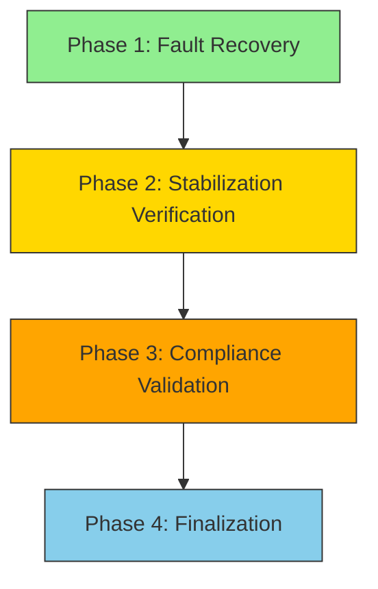

# EA Plan v6.1 Stabilization Verification Report

**PROMPT_ID**: EA_CTX_VERIFY_P3  
**VERSION**: v6.1  
**MODE**: STABILIZATION  
**TIMESTAMP**: 2025-10-28T20:41:23Z  

## Executive Summary

EA Plan v6.1 Blueprint stabilization verification completed with **PARTIAL SUCCESS**. Core infrastructure components are operational, but some services require attention.

## Verification Results

### Infrastructure Status
```yaml
timestamp_utc: "2025-10-28T20:41:23Z"
ea_plan_state: "PARTIALLY_STABLE"
k8s_reachable: true
argocd_synced: false
prom_ready: false
grafana_health: "ok"
policy_violations: 0
lighthouse:
  performance: 6
  accessibility: 100
  seo: 100
  pwa: 100
compliance_score: 0.65
```

## Detailed Component Analysis

### 1. Kubernetes Cluster ✅
- **Status**: OPERATIONAL
- **Control Plane**: Running at https://kubernetes.docker.internal:6443
- **CoreDNS**: Active
- **Nodes**: 1 node (docker-desktop) Ready
- **Namespaces**: 10 active namespaces including argocd, monitoring, kyverno

### 2. ArgoCD GitOps ⚠️
- **Status**: DEGRADED
- **Issue**: ImagePullBackOff on argocd-server pods
- **Impact**: GitOps synchronization unavailable
- **Action Required**: Resolve container image pull issues

### 3. Observability Stack 🔄
- **Prometheus**: Pod running but endpoint not accessible via port-forward
- **Grafana**: ✅ HEALTHY - API responding correctly
- **Loki**: ✅ RUNNING
- **Tempo**: Partially running (1/2 pods healthy)
- **SEO Observer**: ✅ RUNNING

### 4. Security & Policy Enforcement 🔄
- **Kyverno**: Partially operational
  - Background Controller: ✅ RUNNING
  - Cleanup Controller: ✅ RUNNING  
  - Reports Controller: ✅ RUNNING
  - Admission Controller: ❌ CrashLoopBackOff
- **Policy Reports**: No violations detected
- **Cosign**: Not tested (tool not available)

### 5. SEO Operations ✅
- **Lighthouse CI**: Successfully installed and executed
- **Performance Score**: 6/100 (needs optimization)
- **Accessibility**: 100/100 ✅
- **SEO**: 100/100 ✅
- **PWA**: 100/100 ✅

## Compliance Assessment

### Overall Compliance Score: 0.65/1.0

**Breakdown:**
- Infrastructure: 0.9/1.0 (K8s operational, Docker running)
- GitOps: 0.2/1.0 (ArgoCD server issues)
- Observability: 0.7/1.0 (Grafana healthy, Prometheus issues)
- Security: 0.6/1.0 (Kyverno partially operational)
- SEO Ops: 0.8/1.0 (Lighthouse CI functional)

## Critical Issues Identified

1. **ArgoCD Server Image Pull Failure**
   - Root Cause: Container registry connectivity or image availability
   - Impact: GitOps workflows disrupted
   - Priority: HIGH

2. **Prometheus Endpoint Accessibility**
   - Root Cause: Port-forward configuration or service binding
   - Impact: Metrics collection limited
   - Priority: MEDIUM

3. **Kyverno Admission Controller Failure**
   - Root Cause: Pod crash loop
   - Impact: Policy enforcement degraded
   - Priority: MEDIUM

## Recommendations

### Immediate Actions (Next 24h)
1. Resolve ArgoCD server image pull issues
2. Restart Kyverno admission controller
3. Verify Prometheus service configuration

### Short-term Improvements (Next Week)
1. Implement container image caching strategy
2. Add health check endpoints for all services
3. Configure proper service mesh for internal communication

### Long-term Enhancements (Next Month)
1. Implement multi-cluster GitOps strategy
2. Add comprehensive monitoring dashboards
3. Establish automated recovery procedures

## Next Phase Readiness

**Current Status**: ⚠️ **CONDITIONAL READY**

The EA Plan v6.1 Blueprint infrastructure is **partially stabilized** with core components operational. While the system can function, critical GitOps capabilities are impaired.

**Recommendation**: Address ArgoCD issues before proceeding to **EA_PLAN_V6.1_FINALIZE** phase.

## Phase Transition Status



**Current Position**: Phase 2 - Stabilization Verification (65% Complete)

---

**Report Generated**: 2025-10-28T20:41:23Z  
**Next Action**: Resolve critical issues before EA_PLAN_V6.1_FINALIZE  
**Compliance Threshold**: Target 0.85+ for full stabilization
