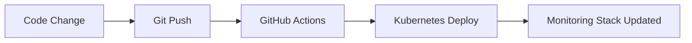

# 🚀 GitHub Repository Kurulum Rehberi

**Version:** v6.8.0  
**Last Update:** 2025-01-27

## 📋 Adım Adım Kurulum

### 1. GitHub'da Repository Oluştur
1. **GitHub'a giriş yapın:** https://github.com
2. **Yeni repository oluşturun:** https://github.com/new
3. **Repository bilgileri:**
   - **Repository name:** `desewebv5-gitops`
   - **Description:** `Dese EA Plan v5.0 - GitOps Monitoring Stack`
   - **Visibility:** Public veya Private (tercihinize göre)
   - **Initialize:** ❌ README, .gitignore, license ekleme (zaten mevcut)

### 2. Repository Oluşturulduktan Sonra
```bash
# Mevcut local repository'yi GitHub'a bağla
git push -u origin main
```

### 3. CI/CD Pipeline Aktifleştirme
1. **GitHub repository'sine gidin**
2. **Actions tab'ına tıklayın**
3. **"GitOps Deploy" workflow'unu bulun**
4. **"Enable workflow" butonuna tıklayın**

## 📁 Repository İçeriği

### 🎯 **Monitoring Stack:**
- ✅ Prometheus (v2.54.0)
- ✅ Grafana (v11.2.0) 
- ✅ Loki (v3.2.1)
- ✅ Tempo (v2.5.0)
- ✅ SEO Observer (Node.js + Lighthouse)

### 🔧 **GitOps Dosyaları:**
- ✅ `.github/workflows/gitops-deploy.yml` - CI/CD Pipeline
- ✅ `monitoring-stack-export.yaml` - Kubernetes manifestleri
- ✅ `gitops-sync.ps1` - PowerShell sync script
- ✅ `gitops-sync.sh` - Bash sync script

### 📊 **Export Dosyası:**
- **Boyut:** 45,962 bytes
- **İçerik:** Tüm Kubernetes kaynakları
- **Format:** YAML

## 🎉 **Kurulum Tamamlandığında**

### Otomatik Deployment:
- Her `git push` işleminde monitoring stack otomatik güncellenir
- GitHub Actions ile Kubernetes cluster'ına deployment yapılır
- Tüm değişiklikler version control altında takip edilir

### Erişim Bilgileri:
- **Grafana:** http://localhost:3000 (admin/admin)
- **Prometheus:** http://localhost:9090
- **Port-forward:** `kubectl port-forward service/grafana 3000:3000 -n monitoring`

## 🔄 **GitOps Workflow**



## ✅ **Sonraki Adımlar**
1. GitHub'da repository oluşturun
2. `git push -u origin main` komutunu çalıştırın
3. GitHub Actions'ı aktifleştirin
4. Monitoring stack'i test edin

**Repository oluşturduktan sonra tekrar "GitHub repo'yu bağla" yazın!** 🚀
